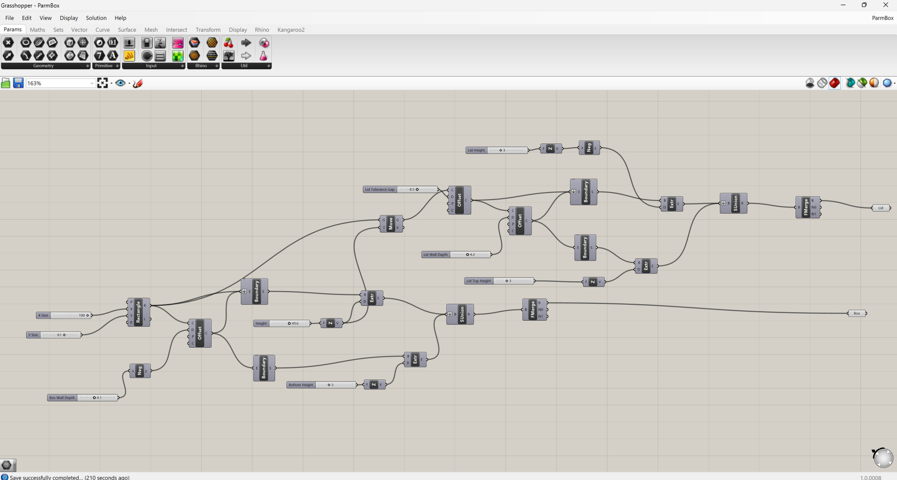

# Week 3 09/12/2024-09/19/2024
## Week 3: Report 1

This week I focused on creating my phone stand using Grasshopper. The idea behind my design was that when I use my phone for video calls with my friends I tend to run into the issue of my phone battery dying. When this happens it means that I must hold up my phone for the duration of the rest of the call. This tends to get quite annoying so I created this stand so that it can hold up my phone while also being able to be plugged into the charger. 

  

My design was challenging to create as it contained three different parts fitting into one another, unfolding at the appropriate angles and containg properly sizeed clearance holes for fasteners. In addition to just the composition of my design I also wanted it to be compact, foldable, and as thin as i could make it. 

  

overall I am pleased with the design that I created but if I were to go back and edit it I would make it slightly less wide in order to support the phone better and adjust the angles of the arms slightly.

Here is the link to the video that I made going more in-depth into the design of my phone stand: https://youtu.be/kYWouX_ynT8

# Week 2 09/05/2024-09/12/2024
## Week 2: Report 1 #

I started off with making a chart of what I thought to be the different portions of the example Grasshopper file and how this was made into the different parts of the model.

From looking at the provided model I was still confused on how many of the different operations in Grasshopper would function as I have never used this software before. I ended up finding a tutorial online of someone walking through step by step on how to create a parametric box using Grasshopper. I found working through this tutorial to be very helpful in starting to get down some of the basic commands.

 

With my baseline understanding of Grasshopper I decided that I wanted to try and make something of my own in order to see if I could apply what I had learned properly. I chose that the gearbox that I had previously made (and modeled in Fusion360 before) would be a good thing for me to try and get the overall shape down of. It took some trial and error and working through some things but I was able to get the overall shape correct. Trying to get the hole cut-outs in the bottom plate is a work in progress which I have not yet figured out how to do. 

 

  

---

## Week 2: Report 2 #

I decided to continue editing the model of the gearbox that I had started eariler in the week. In order to complete the overall body of it I needed to add holes in both the bottom plate and the face of the rectangular portion. I played around with the solid difference tool but I cannot get the holes to go all the way through the part.

---

# Week 1 08/29/2024-09/05/2024
## Week 1: Report 1 #

For this week I had a bit of a difficult time in deciding what I wanted to make. Whle trying to come up with something that I could design that would be useful for me I observed many of my classmates making Cal themed objects for their design. I decided that I wanted to try and make a functional yet fun object while being tangentially related to Cal. Thus, I decided to design a cartoon bear holding a bowl. 

The first step in my process was to create a rough sketch of what I wanted it to look like. I wanted the bear to be sitting down and holding the bowl between his arms. An image of my initial sketch can be seen below. 

With an initial rough layout of what I wanted my design to look like I next moved into creating a 3d model of my design. Since I knew that the design of the bear would be a bit more freeforme I thought that belnder would be the most ideal way for me to be able to model it. The bear and bowl are made up of majority spheres that have been resized and manipulated in order to create the figure. The model that I created for the bear ended up looking more like a teddy bear than a cartoon one that I had originally envisoned in my head. 

Once I had gotten my model to a point where I was happy with it I exported it from Blender and put it into PrusaSlicer. Here I scaled up my model and added in the supports. I was a bit suprised a how small I needed to make my model in order for it to print in a reasonble amount of time, being that a small model would take about 5 hours.

After this, I proceeded to print out my model, wait for it to finish, and then remove all of the supports and clean it up. When the small version of my design had finished I ended up scaling it up to print larger so that I would actually be able to have it hold things. Pictures of this process and my finished product can be seen below.
 
   

With the time that I spent on this model I am content with how it turned out. I think there are multiple ways in which I could improve this and make it overall better. For the design of it I wish I had made it look a bit more like a real bear than a teddy bear plus my original plan also included having the Cal logo imprinted in the back of the bear.

## Quick Links, compiled here for your convenience: ##

- [TDF Wiki](https://github.com/Berkeley-MDes/24f-desinv-202/wiki) - the ultimate source for truth and information about the course and assignments
- [Google Drive Folder](https://drive.google.com/drive/u/0/folders/1DJ1b6sSDwHXX6NRcQYt10ivyQSgU0ND6) - slides and other resources
- [bCourses](https://bcourses.berkeley.edu/courses/1537533) - where the grading happens
