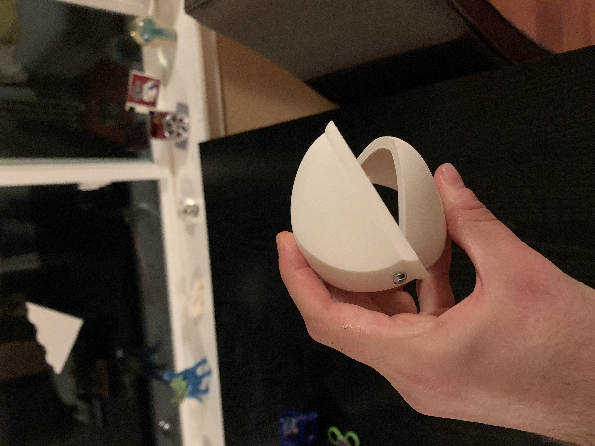

# Week 7 10/10/2024-10/17/2024
## Week 7: Report 1
This week was lots of focus on working on project 2. We first worked together in order to come up with a idea for the project that we wanted to work on that fulfilled the requirements. Our idea consisted of two main components. a button that can be pressed remotly in order to trigger an led light to turn on and a model of a beak which would open when a person is close enough to the proximity sensor. 

Once we had our initial idea of what we wanted to do, I started with first working on creating a model for the beak. During class, we had created an initial cardboard model of what we thought a possible design would be. From this, I worked on creating a 3d model of this that would have screws in order to act as the hinges for the mouth to open and close. 

 

## Week 7: Report 2
Once we had an initial base for what we wanted the beak to look like, I moved into working on trying to make the proximity sensor and servo motor function together. I first made the RGB led function with the proximity sensor in order to more easily test out that my code was functioning correctly. I had it so that when proximity was between 80 and 20 the led would turn green, when proximity is closer than 20 it will turn red, or else it would turn blue. 

https://youtube.com/shorts/AW2mKCWXW2g?feature=share

Once I had this code working I tried to adjust it for the servo instead. I thought that this would be simple, as I would just have to change the led to making the servo write to a specific angle. When I did this, nothing occured. I tested to make sure that both the proximity sensor and the servo were functioning independently but do not work together. I tried troubleshooting the code in multiple different ways including having the proximity sensor using the particle to power it and the servo being powered off of the external battery and making the baud rate slower. Neither of these worked so I tried using the ultrasonic sensor instead. I used the same framework code but replaced the proximity sensor with the ultrasonic one and it worked on the first try. 

https://youtube.com/shorts/tiwMlrAHarw?feature=share

The last thing that I worked on for this week was in improving the design of the beak. I made the hinges on which the screws move the top and bottom of the beak integrate into the design better. On the bottom portion of the beak I added in a bunch of small holes that will allow for it to be sewn into the stuffed penguine. For the top beak, I added in a part that sticks out with a hole in it so that it can be attached to the servo in order to open. 

  

# Week 6 10/03/2024-10/10/2024
## Week 6: Report 2
This week has consisted of very much frustration for me reguarding the photon. On Saturday afternoon I was working on testing out the different sensors with the photon in Jacobs. Once I had finished I decided to go home and continue ,y work. When I plugged in my photon at home it began to continually blink blue, not able to access the wifi. Since this time I have spent many hours going in circles trying to troubleshoot and get my photon to connect to the wifi. This blinking light has become a source of frustration for me and I have not been able to connect or flash anythng to the photon since Saturday. I have tried resetting, restoreing, and running many different commmands in the CLI but nothing seems to work :(

https://github.com/user-attachments/assets/9f45accc-5c95-4933-b94d-4a51349b09c0

## Week 6: Report 1
In completing the homework for this weekend I needed to solder the SparkFun shield. This turned out to be a bit more complicated due to the fact that I initially soldered the connectors to the board upside down. 

I only realized this once I had finished soldering all of the pins and tried to attach it to the photon and it did not fit. I have never desoldered before but it was now necessary for me to figure out how to. Thankfully Gary was able to asist me in what would be the best way to remove the connectors. Unfortunatly, this involved needing to basically break it apart in order to fix it. The first thing that I needed to do was carefully pry the plastic cover off of the pins. Once this was off I used the soldering iron to heat up the solder that I had placed on each of the pins and once it was liquid I used tweezers to pull the pins out of each of the holes. With the pins removed most of the holes were still filled with solder. I then used the soldering iron again to heat up the remaining solder and used the solder sucker to get it out. 

After the solder was removed from all of the holes, Gary gave me new pins to resolder to the board the correct way. 

Now, with my board assembled correctly, I worked on attaching the sensors. The first one that I did was the MPU-6050. For this, I had the gyroscope enabled. This allowed for the position values to be printed in the serial monitor. It can be seen that as I rotate the device the numbers of the position change accordingly in the x, y, and z directions.

https://youtube.com/shorts/fSxvDcgkZ8c?feature=share

After this, I used the APDS 9960 board with the proximity sensor enabled. Here it is set up to detect the disance that an object is away from the sensor. As my hand moved closer to the board it can be seen that the proximity value increases. 

https://github.com/user-attachments/assets/d0a4d691-6716-4919-ad94-ed5e3ce76004

# Week 5 09/26/2024-10/03/2024
## Week 5: Report 2
This week I worked on going through multiple of the tutorials in order to familiarize myself with many of the components that were given to us. The first tutorial that I worked through was in getting a led to flash at a varying frequency that increases when a button is pressed. The led starts off flashing very slowly and every time the button is pressed, this gets faster until it meets a threshold in which it then loops back to flashing at its slow rate.

https://youtube.com/shorts/kGs-4r-hwNw?feature=share

The next tutorial was in using a pressure sensor and RGB led. The sensor uses the pressure that is applied to it to create an electrical signal. This signal is then used by the led to determine the colors that it will produce. Varying the pressure then changes the colors with the led turning white when the highest pressure it can sense it provided. 

https://youtube.com/shorts/E6OdYqmTeAg?feature=share

The last tutorial that I did was in using the potentiometer to adjust the angle that the servo motor rotates. I decided to use the potentiometer in this tutorial instead of the accelerometer and edited the provided code for this. The potentiometer allows for the rotations provided in it to correspond to the angle that the servo rotates between 0 and 180 degrees.

https://youtube.com/shorts/bO__WhVxM3w?feature=share

I enjoyed working with the electronics and refreshing myself on how many of these components function together. I had wanted to have the oled board function but could not figure out how to get the proper libraries in order to making it function. I intend to continue working on this so that I can figure out how to use this. 

## Week 5: Report 1

Over the weekend I worked on better understanding the Photon. The first step that I went through was getting it connected to my home wifi which I found to be quite simple to do. 

Once I had it connected I proceeded through the provided into codes. The first two provided codes were to print Hello World in the serial monitor, first as one line and then printing each individual letter. 

https://github.com/user-attachments/assets/ec2d6ab2-feb0-4c5e-88bc-0137bc9e7265

After completing this I worked on wiring the breadboad to include a button. This button when pressed would cause "button pressed" to be printed in the serial monitor and vary the speed at which "Hello World" was being printed in the monitor. Each button press corresponded to the system choosing a random speed at which this would be printed. 

https://github.com/user-attachments/assets/eb2836c5-e020-4b1c-9784-9a9fb397e160

To keep adding onto this, the next two codes allowed for first one and then two leds to be connected. These would then flash at the same randomized rate that the letters were being printed at. 

https://github.com/user-attachments/assets/1e26b466-a87f-4608-9a75-edebbcd6c47a

After I had gotten through all of these provided codes I decided to play around and edit them. I took out the randomization in the speed with each button press. I then changed it so that everything was waiting for the button to be pressed to commence. Once the button is pressed both "botton pressed" and "Hello World" will print once in the serial monitor. After this occurs the green led will flash and then the red led. The system then waits for the button to be pressed again before running through the functions. 

https://github.com/user-attachments/assets/b42dc26d-ff08-4e06-9d0c-018f9203a566

# Week 4 09/19/2024-09/26/2024
## Week 4: Report 1

My main focus at the beginning of the week was in finishing the report for project 1. I am overall satisfied with the product that I was able to make for this project and have even actaully started using it to call my friends. I was surprised by how well recieved my phone stand was by my peers and might go back and edit this design to improve it given their provided feedback.

As we move into our next project we were tasked with creating an ecosystem map. In mine I chose to map out some of the most common ways that I interact with devices in a typical day. My diagram is separated into three main categories: my watch, cell phone, and laptop. Once I listed out all of the main ways that I use these devices I grouped them into four distinct categories of tasks: fitness, productivity, entertainment, and communication. As can be seen in my diagram, there is quite a lot of overlap between what I tend to do on my phone and computer, with most of these living in the categories of entertainment and communication. 

When looking at my watch and phone there is not nearly as much overlap. The ones that do exist are all in the category of fitness (with my alarm and time being an outlier). I would not necessarily consider my watch to be a "smart watch" as it is designed primarily for activity tracking. It has functions such as being able to tell you the weather and if I get a notification on my phone but I have these features disabled as they don't seem very effective as you need to continually synch your phone with the watch in order to have them function. Thus, outside of regular telling the time I utilize it pretty much only for tracking my runs and activity. This also expalins why there are no real overlaps between my laptop and watch that I could think of that I do on a regular basis.

# Week 3 09/12/2024-09/19/2024
## Week 3: Report 1

This week I focused on creating my phone stand using Grasshopper. The idea behind my design was that when I use my phone for video calls with my friends I tend to run into the issue of my phone battery dying. When this happens it means that I must hold up my phone for the duration of the rest of the call. This tends to get quite annoying so I created this stand so that it can hold up my phone while also being able to be plugged into the charger. 

  

My design was challenging to create as it contained three different parts fitting into one another, unfolding at the appropriate angles and containg properly sizeed clearance holes for fasteners. In addition to just the composition of my design I also wanted it to be compact, foldable, and as thin as i could make it. 

  

overall I am pleased with the design that I created but if I were to go back and edit it I would make it slightly less wide in order to support the phone better and adjust the angles of the arms slightly.

Here is the link to the video that I made going more in-depth into the design of my phone stand: https://youtu.be/kYWouX_ynT8

# Week 2 09/05/2024-09/12/2024
## Week 2: Report 1 #

I started off with making a chart of what I thought to be the different portions of the example Grasshopper file and how this was made into the different parts of the model.

From looking at the provided model I was still confused on how many of the different operations in Grasshopper would function as I have never used this software before. I ended up finding a tutorial online of someone walking through step by step on how to create a parametric box using Grasshopper. I found working through this tutorial to be very helpful in starting to get down some of the basic commands.

 

With my baseline understanding of Grasshopper I decided that I wanted to try and make something of my own in order to see if I could apply what I had learned properly. I chose that the gearbox that I had previously made (and modeled in Fusion360 before) would be a good thing for me to try and get the overall shape down of. It took some trial and error and working through some things but I was able to get the overall shape correct. Trying to get the hole cut-outs in the bottom plate is a work in progress which I have not yet figured out how to do. 

 

  

---

## Week 2: Report 2 #

I decided to continue editing the model of the gearbox that I had started eariler in the week. In order to complete the overall body of it I needed to add holes in both the bottom plate and the face of the rectangular portion. I played around with the solid difference tool but I cannot get the holes to go all the way through the part.

---

# Week 1 08/29/2024-09/05/2024
## Week 1: Report 1 #

For this week I had a bit of a difficult time in deciding what I wanted to make. Whle trying to come up with something that I could design that would be useful for me I observed many of my classmates making Cal themed objects for their design. I decided that I wanted to try and make a functional yet fun object while being tangentially related to Cal. Thus, I decided to design a cartoon bear holding a bowl. 

The first step in my process was to create a rough sketch of what I wanted it to look like. I wanted the bear to be sitting down and holding the bowl between his arms. An image of my initial sketch can be seen below. 

With an initial rough layout of what I wanted my design to look like I next moved into creating a 3d model of my design. Since I knew that the design of the bear would be a bit more freeforme I thought that belnder would be the most ideal way for me to be able to model it. The bear and bowl are made up of majority spheres that have been resized and manipulated in order to create the figure. The model that I created for the bear ended up looking more like a teddy bear than a cartoon one that I had originally envisoned in my head. 

Once I had gotten my model to a point where I was happy with it I exported it from Blender and put it into PrusaSlicer. Here I scaled up my model and added in the supports. I was a bit suprised a how small I needed to make my model in order for it to print in a reasonble amount of time, being that a small model would take about 5 hours.

After this, I proceeded to print out my model, wait for it to finish, and then remove all of the supports and clean it up. When the small version of my design had finished I ended up scaling it up to print larger so that I would actually be able to have it hold things. Pictures of this process and my finished product can be seen below.
 
   

With the time that I spent on this model I am content with how it turned out. I think there are multiple ways in which I could improve this and make it overall better. For the design of it I wish I had made it look a bit more like a real bear than a teddy bear plus my original plan also included having the Cal logo imprinted in the back of the bear.

## Quick Links, compiled here for your convenience: ##

- [TDF Wiki](https://github.com/Berkeley-MDes/24f-desinv-202/wiki) - the ultimate source for truth and information about the course and assignments
- [Google Drive Folder](https://drive.google.com/drive/u/0/folders/1DJ1b6sSDwHXX6NRcQYt10ivyQSgU0ND6) - slides and other resources
- [bCourses](https://bcourses.berkeley.edu/courses/1537533) - where the grading happens
